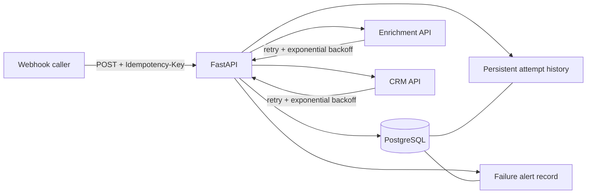

# Architecture notes

This repository is intentionally small enough to review in a few minutes, while still demonstrating production-oriented reliability patterns.

## Reliability decisions

- **Idempotency is persisted**, not held in process memory. `lead_events.idempotency_key` has a database unique constraint.
- **Duplicate webhook delivery does not re-run side effects.** The existing event is returned.
- **Retries are bounded and observable.** Every upstream attempt is a database row with stage, attempt number, outcome, HTTP status and error.
- **Retrying a failed business event is explicit.** `POST /events/{id}/retry` targets that event instead of silently replaying a duplicate webhook.
- **Terminal failure is durable.** The event becomes `FAILED` and an alert record is persisted.
- **Validation occurs at the edge.** Invalid input is rejected by Pydantic before any upstream call.
- **The mock APIs fail deterministically.** This makes the demo and tests reproducible rather than dependent on flaky external services.

## Production hardening beyond this demo

For a high-volume system, the synchronous processor would normally be replaced by a durable queue/outbox worker. The same idempotency key, event state, attempt history, and retry semantics can be retained around that worker. Other likely additions are migrations, structured telemetry, secrets management, auth/signature verification, rate limiting, dead-letter handling and SLO dashboards.
