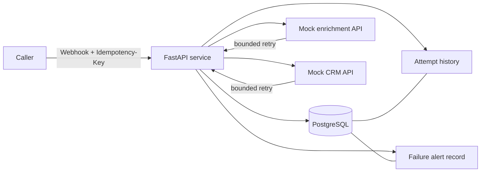

[](https://github.com/Morphined/reliable-lead-webhook-demo/actions/workflows/tests.yml)

# Reliable Lead Webhook Demo

A small portfolio project that demonstrates the part of automation work clients often pay for **after the happy path is already working**: preventing duplicate side effects, recovering from transient failures, preserving an audit trail, and making terminal failures visible.

The demo receives a lead webhook, validates it, enriches the company, sends the lead to a CRM, and records the complete processing lineage in PostgreSQL.

## What this proves

- Request validation with FastAPI/Pydantic
- Durable idempotency using a database unique constraint
- Retry with exponential backoff for transient upstream failures
- Persistent per-stage attempt history
- Duplicate prevention: the same `Idempotency-Key` never repeats side effects
- Explicit retry of a failed event
- Terminal failure state + persistent alert record
- Deterministic mock APIs for a reproducible demo
- Automated tests for success, duplicate delivery, transient retry, hard failure, explicit retry, and validation

## Architecture



See [ARCHITECTURE.md](ARCHITECTURE.md) for the design rationale.

## Run the automated tests

```bash
python -m venv .venv
# Windows: .venv\Scripts\activate
# Linux/macOS: source .venv/bin/activate
pip install -r requirements.txt
pytest
```

The test suite uses in-memory SQLite plus `httpx.MockTransport`, so it does not require Docker or internet-accessible APIs.

## Run the full PostgreSQL demo with Docker

1. Copy the environment template:

```powershell
Copy-Item .env.example .env
```

2. Start the stack:

```powershell
docker compose up --build
```

3. Open Swagger UI at `http://localhost:8000/docs`, or in a second PowerShell window run:

```powershell
./scripts/demo.ps1
```

The stack contains:

- API: `localhost:8000`
- deterministic mock CRM/enrichment service: `localhost:8090`
- PostgreSQL 16 inside Docker

## Four useful demo cases

### 1. Happy path

Use email `buyer@example.com`. Both upstream calls succeed and the event becomes `SUCCESS`.

### 2. Duplicate delivery

Send the same webhook again with the same `Idempotency-Key`. The existing event is returned with `duplicate: true`; the enrichment and CRM side effects are not executed again.

### 3. Transient failure and recovery

Use email `retry@example.com`. The mock enrichment API returns HTTP 503 twice, then succeeds. The event ends as `SUCCESS`, while the attempt history shows `FAILED`, `FAILED`, `SUCCESS` for the enrichment stage.

### 4. Terminal failure and alerting

Use email `hardfail@example.com`. Enrichment succeeds, but CRM returns HTTP 503 for all retry attempts. The event becomes `FAILED`, all attempts remain queryable, and an alert record is persisted.

## Inspect lineage

List events:

```powershell
Invoke-RestMethod http://localhost:8000/events | ConvertTo-Json -Depth 8
```

Get one event:

```powershell
Invoke-RestMethod http://localhost:8000/events/<event-id> | ConvertTo-Json -Depth 8
```

Explicitly retry one failed event:

```powershell
Invoke-RestMethod -Method Post http://localhost:8000/events/<event-id>/retry | ConvertTo-Json -Depth 8
```

A successful event returns HTTP 409 if an explicit retry is attempted, so a successful side effect is not replayed accidentally.

## Why the mock service is included

A portfolio reliability demo should fail *on command*. Depending on a real third-party outage makes the evidence weak and irreproducible. The included mock APIs create three deterministic scenarios based on the lead email:

| Email pattern | Behavior |
|---|---|
| normal email | success |
| contains `retry` | enrichment fails twice, then succeeds |
| contains `hardfail` | CRM always fails |

## 60–90 second video script

1. Show the repository and say: “This is a webhook integration where I focused on what happens when production is not perfect.”
2. Run `docker compose up` and open `/docs` or execute `scripts/demo.ps1`.
3. Show the normal lead succeeding.
4. Send the same idempotency key again and point out `duplicate: true` with no repeated side effects.
5. Send `retry@example.com` and show the attempt lineage: two 503 failures, then success.
6. Send `hardfail@example.com` and show `FAILED`, three CRM attempts, and the persisted alert.
7. Finish on `tests/test_webhooks.py`: “The behavior is covered by automated tests, not just a manual demo.”

## Scope

This is deliberately a compact portfolio project, not a claim that a synchronous HTTP request is the ideal architecture for every webhook system. At higher volume I would put processing behind a durable queue/outbox worker while keeping the same persisted idempotency and lineage model.
